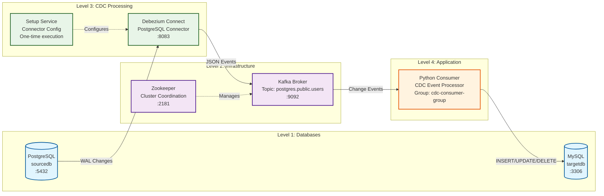

# Catchme - CDC Pipeline

A real-time Change Data Capture (CDC) pipeline that automatically replicates data changes from PostgreSQL to MySQL using Debezium, Kafka, and Python.

## What It Does

When you insert, update, or delete records in PostgreSQL, those changes are automatically captured and replicated to MySQL in real-time. Perfect for keeping databases synchronized, creating data backups, or feeding data to analytics systems.

## Architecture



## How It Works

1. **PostgreSQL** captures data changes using Write-Ahead Logging (WAL)
2. **Debezium Connect** reads these changes and converts them to JSON events
3. **Kafka** receives and stores the change events in topics
4. **Python Consumer** processes events and applies changes to MySQL
5. **MySQL** receives the replicated data, keeping both databases synchronized

## Quick Start

**Everything is automated** - Docker Compose handles the complete setup including Debezium connector configuration.

```bash
# Start the entire pipeline (includes automatic Debezium setup)
docker-compose up -d

# Check if everything is running
docker-compose ps

# View consumer logs
docker-compose logs -f consumer

# Test the pipeline by inserting data into PostgreSQL
docker-compose exec postgres psql -U postgres -d sourcedb -c "INSERT INTO users (name, email) VALUES ('Test User', 'test@example.com');"
```

The system automatically:
- Configures PostgreSQL for logical replication
- Sets up the Debezium PostgreSQL connector
- Creates all necessary Kafka topics
- Starts the Python consumer

## Components

- **PostgreSQL**: Source database with CDC-enabled users table
- **Debezium Connect**: Captures database changes via logical replication  
- **Kafka**: Message broker for change events
- **Python Consumer**: Processes events and applies changes to MySQL
- **MySQL**: Target database for replicated data

Changes in PostgreSQL are automatically replicated to MySQL through this CDC pipeline.
